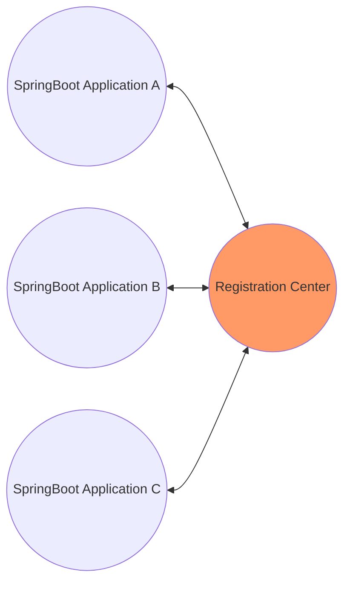
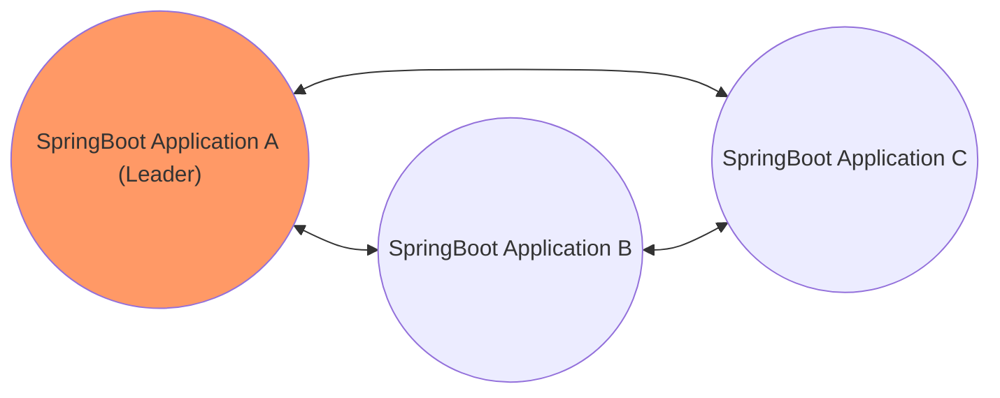

#  Tridenter Framework

**Tridenter** is a distributed collaboration framework  based on <code>SpringBoot</code> framework. It can make  <code>SpringBoot</code> applications easily and quickly form a cluster without relying on external registration center (such as <code>Eureka</code> ,<code>Consul </code>).

### Features
* Decentralized cluster mode
* Message multicast and unicast among cluster member
* Leader election
* Support load-balance algorithm
* Multiprocessing Programing (Process Pool and Scheduled Process Pool)
* Service Registration Center
* Http API Traffic control and downgrade
* Simple <code>RestClient</code>
* Http API gateway
* Cluster monitoring and alarming
* Distributed Transaction (XA)

##  Compatibility

* Jdk 1.8 (or later)
* <code>SpringBoot </code> Framework 2.2.x (or later)
* <code>Redis 3.x</code> (or later)

## Install

```xml
<dependency>
    <groupId>com.github.paganini2008.atlantis</groupId>
    <artifactId>tridenter-spring-boot-starter</artifactId>
    <version>1.0-RC1</version>
</dependency>
```

## Settings

```properties
spring.application.name=demo
spring.application.cluster.name=demo-cluster

# Redis Configuration
spring.redis.host=localhost
spring.redis.port=6379
spring.redis.password=123456

```

## Decentralization or Centralization？

Centralization




Decentralization



**Tridenter** is designed as **decentralization**, that is, developers don't need to know which is the master node, which node is the slave node, and need not explicitly define an application as master node. It depends on  the leader election algorithm adopted by Tridenter. The default election algorithm is the fast election algorithm. According to the election algorithm, any application node in the cluster may become the master node. The first started application by default is the master node. 


## Quick Start

####  1. Process pool

Multiple applications with the same name (<code>${spring.application.name}</code>) can be formed into a process pool, just like the thread pool allocates different threads to call a method, the process pool can call methods across applications as well.

**Example**

``` java
	@MultiProcessing(value = "calc", defaultValue = "11")
	public int calc(int a, int b) {
		if (a % 3 == 0) {
			throw new IllegalArgumentException("a ==> " + a);
		}
		log.info("[" + counter.incrementAndGet() + "]Port: " + port + ", Execute at: " + new Date());
		return a * b * 20;
	}

	@OnSuccess("calc")
	public void onSuccess(Object result, MethodInvocation invocation) {
		log.info("Result: " + result + ", Take: " + (System.currentTimeMillis() - invocation.getTimestamp()));
	}

	@OnFailure("calc")
	public void onFailure(ThrowableProxy info, MethodInvocation invocation) {
		log.info("========================================");
		log.error("{}", info);
	}
```

#### 2. Method slicing
Method slicing is also called method parallel processing. If one method receive a group of parameters, each parameter will be dispatch and run in the other applications of same cluster, and then merge all results and output.

**Example**

``` java
    @ParallelizingCall(value = "loop-test", usingParallelization = TestCallParallelization.class)
	public long total(String arg) {// 0,1,2,3,4,5,6,7,8,9
		return 0L;
	}

	public static class TestCallParallelization implements Parallelization {

		@Override
		public Long[] slice(Object argument) {
			String[] args = ((String) argument).split(",");
			Long[] longArray = new Long[args.length];
			int i = 0;
			for (String arg : args) {
				longArray[i++] = Long.parseLong(arg);
			}
			return longArray;
		}

		@Override
		public Long merge(Object[] results) {
			long total = 0;
			for (Object o : results) {
				total += ((Long) o).longValue();
			}
			return total;
		}

	}
```

#### 3. Rest Client

**Example**

``` java
@RestClient(provider = "test-service")
// @RestClient(provider = "http://192.168.159.1:5050")
public interface TestRestClient {

	@PostMapping("/metrics/sequence/{dataType}")
	Map<String, Object> sequence(@PathVariable("dataType") String dataType, @RequestBody SequenceRequest sequenceRequest);

}
```
Support Spring annotations like <code>GetMapping, PostMapping, PutMapping, DeleteMapping</code>, more parameter settings can refer to  <code>@Api</code>


#### 4. Gateway

**Example 1** 

Start Gateway Application

``` java
@EnableGateway
@SpringBootApplication
@ComponentScan
public class GatewayMain {

	public static void main(String[] args) {
		final int port = 9000;
		System.setProperty("server.port", String.valueOf(port));
		SpringApplication.run(GatewayMain.class, args);
	}
}
```


**Example 2**

Configure routes

``` java
@Primary
@Component
public class MyRouterCustomizer extends DefaultRouterCustomizer {

	@Override
	public void customize(RouterManager rm) {
		super.customize(rm);
		rm.route("/my/**").provider("tester5");
		rm.route("/test/baidu").url("https://www.baidu.com").resourceType(ResourceType.REDIRECT);
		rm.route("/test/stream").url("	https://www.baidu.com/img/PCtm_d9c8750bed0b3c7d089fa7d55720d6cf.png").resourceType(ResourceType.STREAM);
	}

}
```
<code>ResourceType:</code>
1. DEFAULT: Forward request
2. REDIRECT: Redirect to other url
3. STREAM: Binary stream
4. FILE: save as file

#### 5. Http API traffic control and downgrade

**Traffic control** depends on 3 metrics:

* Response timeout rate
* Error rate
* Concurrency

Generally, when any of these three metrics exceeds 80%, the current limit will be triggered and the downgrade service API will be invoked.

#### 6. Health monitoring
* <code>ApplicationClusterHealthIndicator</code>
     Display the overall health status of the cluster
* <code>TaskExecutorHealthIndicator</code>
     Display the health status of the cluster thread pool
* <code>RestClientHealthIndicator</code>
    Display the health status of the Rest client (response timeout rate, error rate, concurrency)
